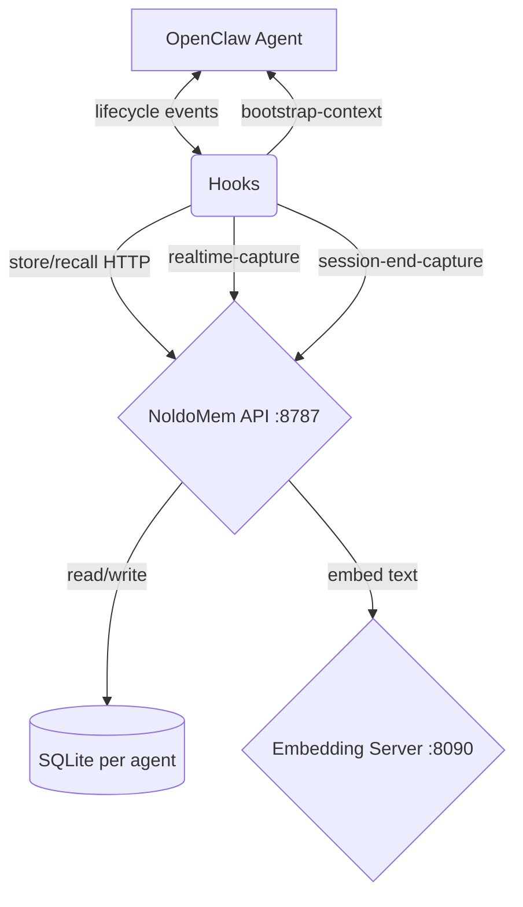

# NoldoMem — Long-Term Memory for OpenClaw AI Agents

[](LICENSE)
[](.github/workflows/ci.yml)
[](https://python.org)

> Long-term memory for [OpenClaw](https://github.com/openclaw/openclaw) AI agents. Named after the Noldor — Tolkien's elves renowned for deep knowledge and craft.

NoldoMem replaces OpenClaw's built-in memory with a persistent, decay-aware memory system. Agents remember important things, forget trivial things over time, and learn from their mistakes — just like real memory.

**Built for OpenClaw.** One SQLite file per agent, no cloud DB, no Docker required.

## Why NoldoMem?

OpenClaw's native memory (`memorySearch`) is basic — keyword search, no decay, no behavioral learning. NoldoMem adds:

| Feature | OpenClaw Native | NoldoMem |
|---------|----------------|----------|
| Search | Keyword only | Hybrid (semantic + BM25 + reranker) |
| Memory decay | No | Ebbinghaus forgetting curve |
| Learn from mistakes | No | Lesson memories with behavioral reinforcement |
| Per-agent isolation | No | Separate SQLite per agent |
| Memory consolidation | No | Auto-compress old memories |
| Prompt injection protection | No | Built-in sanitization |
| Trust/provenance tracking | No | Source + trust_level per memory |
| Pattern-to-policy | No | 3+ same mistake auto-escalates to rule |
| External dependencies | None | Embedding API (cloud or local) |
| Embedding options | Cloud only | Cloud (OpenRouter/OpenAI) or self-hosted |

## Quick Start (OpenClaw)

### Step 1: Install NoldoMem

**Requirements:** Python 3.10+, ~200MB RAM for the API server (embedding server needs more — see Step 2).

```bash
git clone https://github.com/dorukardahan/noldo-memory.git
cd noldo-memory

python3 -m venv .venv
source .venv/bin/activate
pip install -r requirements.txt

cp .env.example .env
# Edit .env: set AGENT_MEMORY_API_KEY (pick any strong secret)
```

### Step 2: Set up embeddings

NoldoMem needs an embedding API (OpenAI-compatible `/v1/embeddings` format).

**Fastest path — use a cloud API** (2 lines in `.env`):
```bash
# In .env:
OPENROUTER_BASE_URL=https://openrouter.ai/api/v1
OPENROUTER_API_KEY=your-key
AGENT_MEMORY_MODEL=openai/text-embedding-3-large
AGENT_MEMORY_DIMENSIONS=3072
```

Works with OpenRouter, OpenAI, or any OpenAI-compatible embedding API.

**Or run locally** (recommended for privacy/cost):

```bash
./scripts/detect-hardware.sh --apply  # auto-detect best model for your hardware
```

| Profile | Model | Download Size | RAM | Best For |
|---------|-------|--------------|-----|----------|
| minimal | EmbeddingGemma 300M | ~300MB | 1-2GB | Raspberry Pi, $5 VPS |
| light | Qwen3-Embedding-0.6B | ~600MB | 2-4GB | Small VPS |
| standard | Qwen3-Embedding-4B | ~4GB | 4-8GB | Mid-range server |
| heavy | Qwen3-Embedding-8B | ~8GB | 12GB+ | Dedicated server |

```bash
# Download model (example: standard profile)
huggingface-cli download Qwen/Qwen3-Embedding-4B-GGUF Qwen3-Embedding-4B-Q8_0.gguf --local-dir models/

# Start embedding server
llama-server --model models/Qwen3-Embedding-4B-Q8_0.gguf \
  --embedding --pooling last --host 127.0.0.1 --port 8090

# In .env:
# OPENROUTER_BASE_URL=http://127.0.0.1:8090/v1
# AGENT_MEMORY_DIMENSIONS=2560
```

### Step 3: Start NoldoMem

```bash
set -a; source .env; set +a
python -m agent_memory
# API starts on http://127.0.0.1:8787
# Data stored in: ~/.agent-memory/ (or ~/.noldomem/ or legacy ~/.asuman/)
# Each agent gets its own SQLite file: memory.sqlite, memory-agent1.sqlite, etc.
```

### Step 4: Configure OpenClaw

**4a. Disable OpenClaw's built-in memory** (important!):

```json
{
  "memorySearch": {
    "enabled": false
  }
}
```

**4b. Enable hooks:**

```json
{
  "hooks": {
    "internal": {
      "enabled": true
    }
  }
}
```

**4c. Install hooks:**

```bash
HOOKS_DIR="$HOME/.openclaw/workspace/hooks"

for hook in realtime-capture session-end-capture bootstrap-context \
            after-tool-call pre-session-save post-compaction-restore \
            subagent-complete; do
  mkdir -p "$HOOKS_DIR/$hook"
  cp "hooks/$hook/handler.js.example" "$HOOKS_DIR/$hook/handler.js"
  cp "hooks/$hook/HOOK.md" "$HOOKS_DIR/$hook/HOOK.md" 2>/dev/null
done
```

**4d. Set the API key for hooks:**

```bash
mkdir -p ~/.noldomem
echo "your-api-key-here" > ~/.noldomem/memory-api-key
chmod 600 ~/.noldomem/memory-api-key
```

**4e. Restart OpenClaw** to load the hooks.

### Step 5: Verify

```bash
curl -s localhost:8787/v1/health
# {"status":"ok","checks":{"storage":true,"embedding":true}}

curl -X POST localhost:8787/v1/store \
  -H "Content-Type: application/json" -H "X-API-Key: YOUR_KEY" \
  -d '{"text": "Test memory from setup", "agent": "main"}'

curl -X POST localhost:8787/v1/recall \
  -H "Content-Type: application/json" -H "X-API-Key: YOUR_KEY" \
  -d '{"query": "test", "agent": "main", "limit": 5}'
```

## LLM Agent Integration

**Put this in your agent's TOOLS.md or system prompt so the agent knows how to use NoldoMem:**

```markdown
## Memory API (NoldoMem)

You have access to a persistent memory system at localhost:8787.
All requests need headers:
- Content-Type: application/json
- X-API-Key: <key> (read from ~/.noldomem/memory-api-key)

### Store a memory
POST /v1/store {"text": "...", "agent": "YOUR_AGENT_ID"}
- Auto-classified as: fact, preference, rule, conversation, or lesson

### Recall memories
POST /v1/recall {"query": "...", "agent": "YOUR_AGENT_ID", "limit": 5}
- Returns relevant memories ranked by relevance + recency + importance
- Filter by type: {"memory_type": "lesson"} for lessons only

### Store a rule (max importance)
POST /v1/rule {"text": "Always run tests before commit", "agent": "YOUR_AGENT_ID"}

### What happens automatically (no action needed)
- Old memories fade over time (Ebbinghaus decay) — use them or lose them
- Lessons decay 3x slower than facts
- Repeated mistakes (3+) become permanent rules
- Your session starts with relevant memories pre-loaded (bootstrap hook)
- Feedback you give ("wrong", "don't do that") is captured as lessons

### Error responses
- 401: Invalid API key. Read key from ~/.noldomem/memory-api-key
- 404: Unknown endpoint. Check URL
- 422: Invalid request body. Check required fields (text, agent)
- 500: Server error (usually embedding server down). Retry in 5 seconds, max 2 retries
```

## How Hooks Work

NoldoMem connects to OpenClaw through 7 lifecycle hooks:

| Hook | When | What It Does |
|------|------|-------------|
| **bootstrap-context** | Session start | Recalls relevant memories + lessons, injects into agent context |
| **realtime-capture** | During chat | Detects feedback/corrections, stores as lessons |
| **session-end-capture** | Session end | Detects unverified suggestions, auto-generates lessons |
| **after-tool-call** | After tool use | Captures command outputs (allowlist-filtered) |
| **pre-session-save** | Before save | Tags session with memory metadata |
| **post-compaction-restore** | After compaction | Re-injects critical memories lost in context compaction |
| **subagent-complete** | Sub-agent done | Captures sub-agent results |

Each hook has a `HOOK.md` in [`hooks/`](./hooks/) explaining its behavior and configuration.

## Architecture



```
Agent Session
    |
    +-- bootstrap-context hook -----> NoldoMem /v1/recall --> inject memories into context
    |
    +-- [conversation happens] -----> realtime-capture hook --> /v1/store (lessons)
    |
    +-- [tool calls] ---------------> after-tool-call hook --> /v1/store (outputs)
    |
    +-- session-end-capture hook ---> /v1/store (unverified suggestions as lessons)
    |
    +-- pre-session-save hook ------> tag session metadata
```

## API Reference

| Endpoint | Method | Auth | Description |
|----------|--------|------|-------------|
| `/v1/health` | GET | No | Health check |
| `/v1/health/deep` | GET | Yes | DB integrity, embedding, disk |
| `/v1/store` | POST | Yes | Store a memory |
| `/v1/recall` | POST | Yes | Hybrid search |
| `/v1/capture` | POST | Yes | Batch ingest (max 200 messages) |
| `/v1/rule` | POST | Yes | Store rule (importance=1.0) |
| `/v1/forget` | DELETE | Yes | Soft-delete |
| `/v1/pin` | POST | Yes | Pin (protect from decay) |
| `/v1/unpin` | POST | Yes | Unpin |
| `/v1/decay` | POST | Yes | Run Ebbinghaus decay |
| `/v1/consolidate` | POST | Yes | Deduplicate + archive |
| `/v1/compress` | POST | Yes | Summarize old memories |
| `/v1/gc` | POST | Yes | Purge soft-deleted |
| `/v1/amnesia-check` | POST | Yes | Check memory coverage |
| `/v1/stats` | GET | Yes | DB statistics |
| `/v1/agents` | GET | Yes | List agent DBs |
| `/v1/metrics` | GET | Yes | Operational metrics |
| `/v1/metrics/lessons` | GET | Yes | Lesson effectiveness |
| `/v1/export` | GET | Yes | Export as JSON |
| `/v1/import` | POST | Yes | Import (max 500) |
| `/v1/admin/rotate-key` | POST | Admin | Rotate API key |

All endpoints accept `?agent=<id>` for per-agent routing.

## Search Architecture

```
Query -> Semantic (0.50) -> sqlite-vec cosine KNN
      -> Keyword  (0.25) -> FTS5 BM25
      -> Recency  (0.10) -> exp(-0.01 * days)
      -> Strength (0.07) -> Ebbinghaus retention
      -> Importance(0.08) -> write-time score
      |
      RRF fusion (k=60) -> Primary reranker (top-10) -> Background reranker (top-3)
```

## Production Deployment

### systemd

```bash
sudo cp noldo-memory.service.example /etc/systemd/system/noldo-memory.service
# Edit: paths, User, EnvironmentFile
sudo systemctl enable --now noldo-memory
```

### Cron (recommended)

See `crontab.example`. Key jobs: daily decay, weekly consolidation + GC, 6-hourly embedding backfill, daily SQLite backup.

### Security checklist

- [ ] `AGENT_MEMORY_HOST=127.0.0.1` (never 0.0.0.0)
- [ ] API key file: permissions 600
- [ ] Data directory: permissions 700
- [ ] `memorySearch.enabled: false` in openclaw.json
- [ ] `hooks.internal.enabled: true` in openclaw.json
- [ ] Embedding server localhost only
- [ ] Backup cron active

### Docker

```bash
cp .env.example .env && mkdir -p models
# Download embedding model into models/
docker compose up -d
```

## Configuration

All config via environment variables. See [`.env.example`](./.env.example) for full list.

## Tests

```bash
pip install -r requirements-dev.txt
python -m pytest tests/ -v   # 187 tests
ruff check agent_memory/     # lint
```

## FAQ

**Can I use NoldoMem without OpenClaw?**
Yes. NoldoMem is a standalone REST API. Any application that can make HTTP requests can store and recall memories. The hooks are OpenClaw-specific, but the API works with anything.

**How much disk space do memories use?**
Roughly 1-2 KB per memory (text + metadata + embedding vector). 10,000 memories take about 15-20 MB. SQLite with WAL mode handles concurrent access well.

**What happens if the embedding server goes down?**
NoldoMem continues to work in degraded mode — keyword search (BM25) still works, but semantic search returns no results. The `/v1/health` endpoint reports `"embedding": false`. Memories stored without embeddings get auto-embedded when the server comes back (via the backfill worker).

**Can multiple agents share memories?**
Each agent has its own isolated SQLite database by design. Use `?agent=<id>` to route requests. Cross-agent search is not supported — this is intentional for safety and privacy.

**How do I force a memory type?**
Pass `"memory_type": "rule"` (or fact/preference/lesson/conversation) in your `/v1/store` request to override auto-classification.

## Troubleshooting

| Problem | Cause & Fix |
|---------|-------------|
| `curl` returns "Unauthorized" | Wrong API key. Check `~/.noldomem/memory-api-key` matches `AGENT_MEMORY_API_KEY` in `.env` |
| `/v1/health` shows `"embedding": false` | Embedding server not running or wrong URL. Check `OPENROUTER_BASE_URL` in `.env` |
| Agent doesn't remember anything | Hooks not loading. Verify `hooks.internal.enabled: true` in `openclaw.json` and restart OpenClaw |
| `vector dimension mismatch` error | Changed embedding model without reindexing. Run `.venv/bin/python scripts/reindex_embeddings.py` |
| Port 8787 already in use | Set `AGENT_MEMORY_PORT=8788` (or any free port) in `.env` |
| Memories disappearing too fast | Decay is too aggressive. Adjust decay cron frequency in crontab, or pin critical memories via `/v1/pin` |
| `sqlite3.OperationalError: database is locked` | Concurrent writes. NoldoMem handles this with WAL mode, but check for external tools accessing the DB |

## Upgrading

```bash
cd /path/to/noldo-memory
git pull origin main
.venv/bin/pip install -r requirements.txt
# Compare .env.example with your .env for new variables
# Database migrations run automatically on startup
sudo systemctl restart noldo-memory
```

## Contributing

See [CONTRIBUTING.md](CONTRIBUTING.md).

## License

MIT
